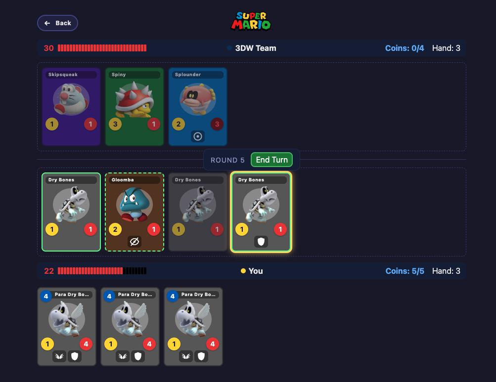

# Mario Cards
> A fan-made Mario Card Game. Goal: get sued by Nintendo.

A Hearthstone-style card game built entirely from the Mario universe: 294 creature
cards spanning Donkey Kong, the Mushroom Kingdom, Yoshi's Island, the Galaxy games,
Wonder and more, each with real keyword abilities (Taunt, Fly, Stealth, Shield, Bomb...)
rather than reskinned stats. Build a 16-card deck, fight a CPU or a friend over
WebSocket, and track wins in your profile's match history.



## Structure

- `shared/` — TypeScript game engine (pure functions) + types + the card catalog (`shared/src/cards.json`), compiled to `shared/dist` and consumed by both the web app and the server.
- `server/` — Node.js (plain JS) WebSocket server for multiplayer. Authoritative: every action is validated through the shared engine.
- `web/` — Next.js + TypeScript frontend (vs CPU mode runs the engine locally in the browser).

## Installation

```sh
npm install
```

## Usage example

One command starts everything (compiles the shared engine, then runs the WebSocket
server on port 8787 and the web app on port 3000 together):

```sh
npm run dev
```

Open http://localhost:3000. For multiplayer, open two tabs: create a room in one,
join with the code in the other.

For a production run (full build + `next start`):

```sh
npm start
```

The pieces can still be run separately if needed: `npm run dev:server` /
`npm run dev:web` (after `npm run build:shared`). The web app reads
`NEXT_PUBLIC_WS_URL` (default `ws://localhost:8787`) to find the game server.

## Rules

- 30 HP per player. Decks are 16 cards (duplicates allowed), shuffled; you draw 1 at
  the start of every turn (empty deck = no draw, no damage).
- 3-card starting hand. Coins are your energy: +1 max per turn (cap 10), refilled at
  turn start; playing a card costs its coin value.
- The board holds up to 7 creatures. A fresh creature has summoning sickness (can't
  attack the turn it's played) unless it has **Quick** or **Bomb**.
- Attacking a creature triggers simultaneous counter-attack damage; anyone at 0 health
  dies. **Fly** creatures can only be hit by **Fly**/**Reach**; **Taunt** must be
  attacked before the face or other creatures; **Stealth** is untargetable until it
  attacks; **Shield** absorbs one hit.
- First player to bring the opponent to 0 HP wins.

Full rules, keyword reference and rarity tiers are in-app at `/how-to-play`.

## Development setup

```sh
npm test   # shared engine unit tests
```

`scripts/` has standalone tools used to balance the card catalog:
`cpu-selfplay.mts` and `simulate-match.mjs` run bulk CPU-vs-CPU matches,
`generate_stats.py` crunches the results.
